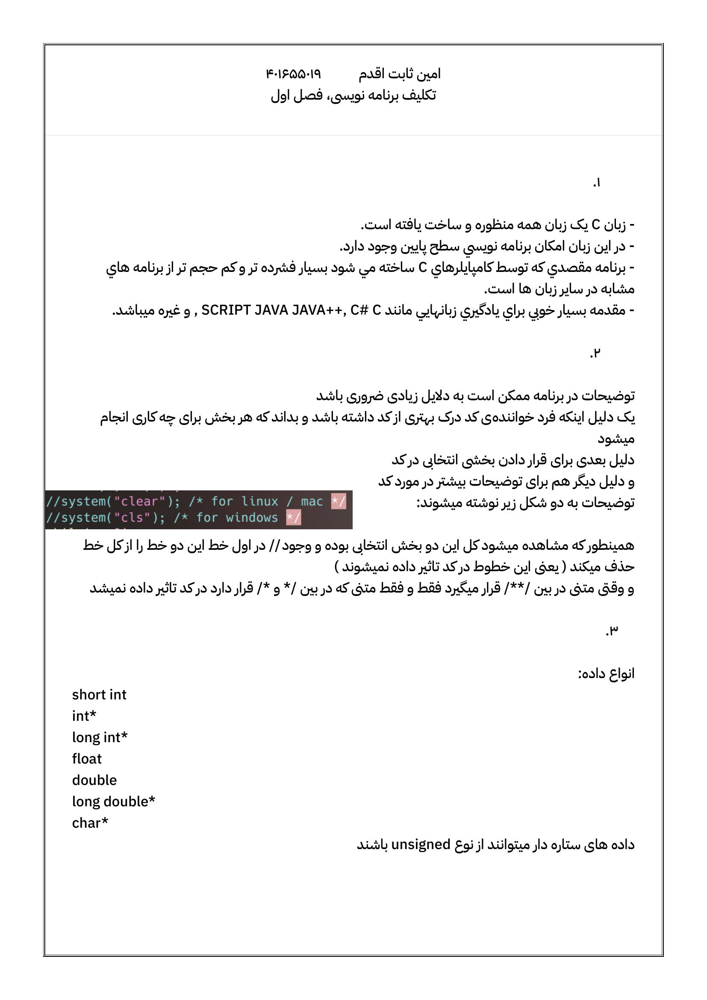
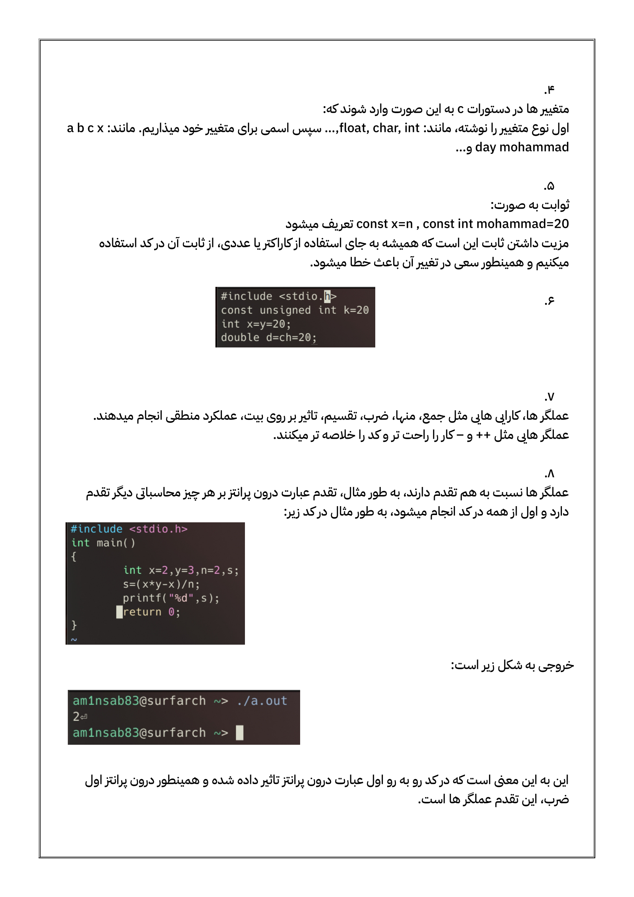
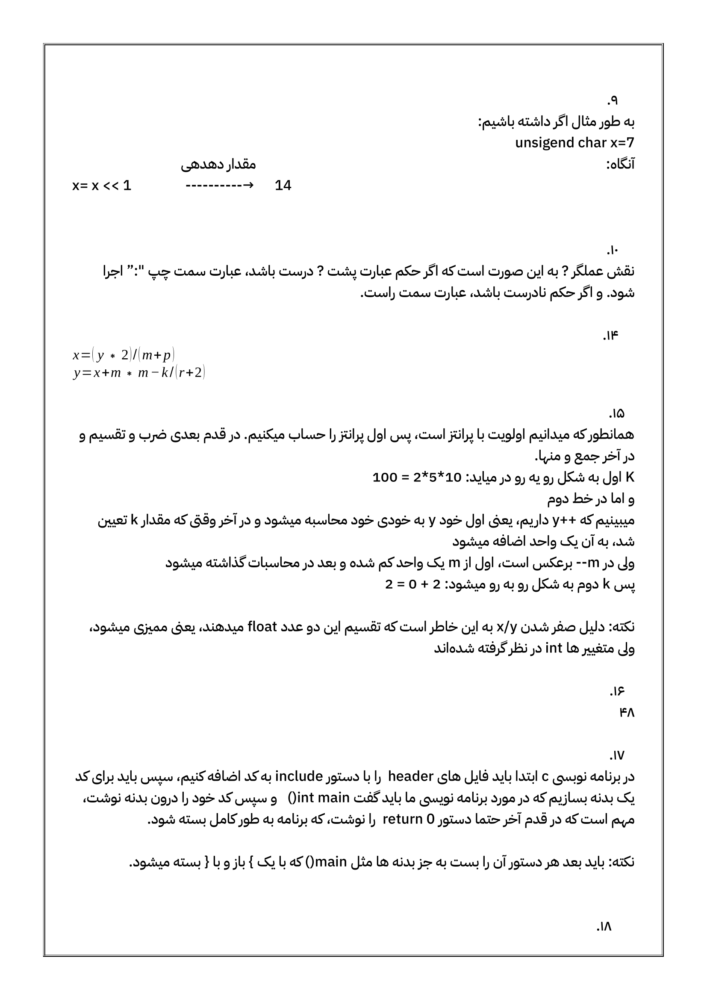
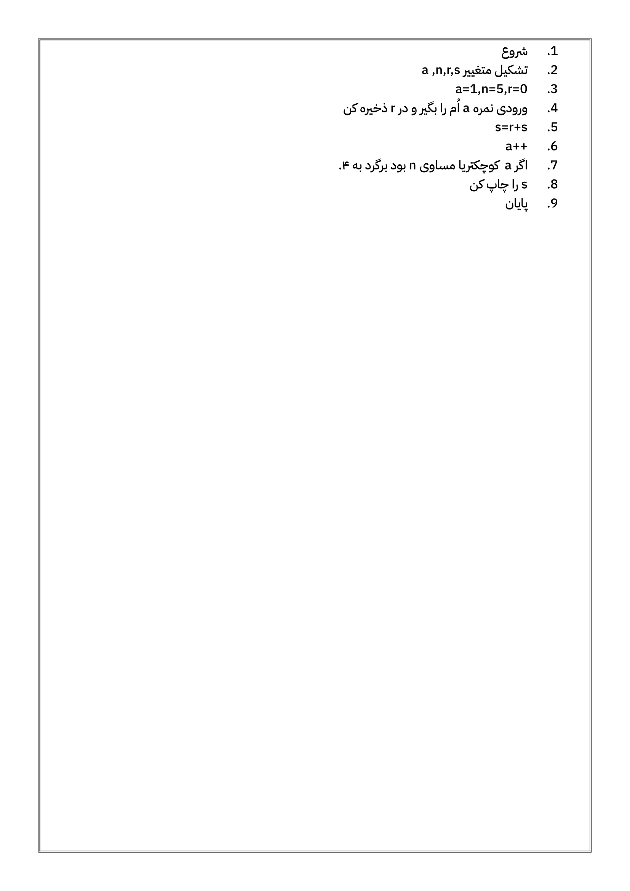

# جواب و حل تکالیف کتاب برنامه نویسی جعفرنژاد قمی فصل ۱ تا ۵
[مستقیم به فصل ۲](am1nsab83.github.io/all#1)


1
---









2
---

1.

 فایل سرآیند به منظور استفاده از دستورات مورد نظر در آن کتابخانه خاص مورد استفاده قرار میگیرد. یک برنامه سی بدون فایل سرآیند به هیچ عنوان قابل نوشتن نیست

---

2.

سرآیند: سرآیند با دستور include به شکل زیر:

#include <"library">

وارد میشود.

بدنه: بدنه‌ی یک برنامه‌ی سی اول به صورت:

init X()

در اینجا init به معنی اینتیجر است
اینجا برنامه برای کار خود در آخر کار یک عدد باید دریافت کند که در آخر کد مابرای پایان بخشیدن به کد دستور:
return 0;
را وارد میکنید که عدد ۰ را به init main برگردانده و برنامه را به طور کامل می‌بندد


---
3.
خطا:
```
3.c:3:1: warning: data definition has no type or storage class
    3 | main();
      | ^~~~
3.c:3:1: warning: type defaults to ‘int’ in declaration of ‘main’ [-Wimplicit-int]
3.c:4:1: error: expected identifier or ‘(’ before ‘{’ token
    4 | {
      | ^
```

شکل درست
:
```
#include <stdio.h>
int main()
{
    printf ("keep looking!");
    printf ("you\'ll find it");
    return 0;
}
```

---

4.


```
#include <stdio.h>

int main()
{
    printf("The answer to the question of\nLife, the Universe, and Everything is 42.");
    return 0;
}
```
out:
```
The answer to the question of
Life, the Universe, and Everything is 42.
```
---
5.

```
#include <stdio.h>
int main()
{
    float x,y;
    printf("please insert X\n:");
    scanf("%f",&x);
    y=1/(x*x+x+3);
    printf("%f",y);
    return 0;
}
```
out (0.2=x):

```
please insert X
:0.2
0.308642
```
---
6.

```
#include <stdio.h>
int main()
{
    float number;
    number = (1/3)*3;
    printf("(1/3)*3 is equal to %5.2f",number);
    return 0;
}
```
out:
```
(1/3)*3 is equal to  0.00⏎ 
```
---
7.

```
#include <stdio.h>
int main()
{
    float kg,g;
    printf("please insert the weight in Kilo Grams\n:");
    scanf("%f",&kg);
    g = kg * 1000;
    printf("weight in Grams is:%f",g);
    return 0;
}
```
out (kg=20.59):
```
please insert the weight in Kilo Grams
:20.59
weight in Grams is:20590.000000⏎ 
```
---
8.

```
#include <stdio.h>
int main()
{
    const int m_m=750000;
    int totp_m,totf_m,totp_y,totf_y,m_m2,dif;
    printf("750000 for each\n");
    totp_m = m_m*2;
    printf("totaly %d rial for both in a month\n",totp_m);
    totp_y = totp_m*12;
    printf("which makes %d rial in year fo company\n",totp_y);
    m_m2 = (m_m*13.5/100)+m_m;
    printf("13.5%% more than their current salary will be %d rials\n",m_m2);
    totf_m=m_m2*2;
    printf("totaly %d rial for both in a month after change\n",totf_m);
    totf_y=totf_m*12;
    printf("which makes %d rial in year fo company afetr change\n",totf_y);
    dif = totf_y-totp_y;
    printf("\nnow the total cost for this change for the company will be %d rials per year.",dif);
    return 0;
}
```
out:
```
750000 for each
totaly 1500000 rial for both in a month
which makes 18000000 rial in year fo company
13.5% more than their current salary will be 851250 rials
totaly 1702500 rial for both in a month after change
which makes 20430000 rial in year fo company afetr change

now the total cost for this change for the company will be 2430000 rials per year.⏎                             
```
---
9.

```
#include <stdio.h>
int main()
{
    float a4p,pp,t,tot,a4np,pnp,tf,totf;
    printf("please insert A4 price, then pen price, then Inflation\n");
    scanf("%f\n%f\n%f",&a4p,&pp,&t);
    tot=a4p*50+pp*150;
    printf("total cost for A4 papers and pens in this company for this year is %f\n",tot);
    printf("total");
    tf=t/100;
    a4np=a4p+(a4p*tf);
    pnp=pp+(pp*tf);
    totf=pnp*150+a4np*50;
    printf("\n and total cost for A4 papers and pens for the next year is %f",totf);
    return 0;
}
```
out (a4p=20 pp=15 t=6.3):
```
please insert A4 price, then pen price, then Inflation
20
15
6.3
total cost for A4 papers and pens in this company for this year is 3250.000000
total
 and total cost for A4 papers and pens for the next year is 3454.750000⏎ 
 ```
 ---
 10.
 
  ```
 #include <stdio.h>
int main()
{
    const float div=0.5;
    float x,y,s;
    printf("please insert the base, then height\n");
    scanf("%f\n%f",&x,&y);
    s = x*y*div;
    printf("the area of the triangel is equel to:%f",s);
    return 0;
}
```
out (x=20,y=15):
```
please insert the base, then height
20
15
the area of the triangel is equel to:150.000000⏎
```
---
11.

```
#include <stdio.h>
int main()
{
    float e,s;
    printf("please insert the water as L\n:");
    scanf("%f",&e);
    s=e*950/3;
    printf("there are %f * 10^23 molcoles in this amount of water",s);
    return 0;
}
```
out (e=20):
```
please insert the water as L
:20
there are 6333.333496 * 10^23 molcoles in this amount of water⏎ 
```
---
12.
```
#include <stdio.h>
int main()
{
    const float sa=3.156;
    int a;
    float f;
    printf("please insert your age (only in years)\n:");
    scanf("%d",&a);
    f=a*sa;
    printf("your age in seconds is equel to:%f * 10^7",f);
    return 0;
}
```
out (a=18):
```
please insert your age (only in years)
:18
your age in seconds is equel to:56.807999 * 10^7⏎ 
```

---

4
---

امین ثابت اقدم

401655019

-----
1.

الگوی تابع باید قبل از int main اعلام شود هر چند بعد از آن هم اعلام شود  مشکلی نیست، همان عنوان تابع هست که میتوان از ذکر نام متغیر ها در لیست پارامتر ها صرف نظر کرد

-------
2.

برای فراخوانی تابع، در تابع فراخوان، نام تابع به همراه آرگومان های تابع در پرانتز ذکر میشوند. آرگومان ها بع ترتیب به عنوان  تابع فراخوانی میشود، حال تابع فراخوانی شده اجازه دارد با مقادیر داده شده کار کند تابع اعمالی را سوی پارامتر ها انجام میدهد، حال بسته به نوع تابع با دستور return مقداری را به مکانی که فراخوانی شده بر میگرداند ( توجه داشته باشید که اگر تابع از نوع void بوده، مقداری را برنمیگرداند و این نوع تابع فقط و فقط وظیفه انجام کاری را دارد نه برگرداندن عدد )

------------
3.

۱. آرگومان ها و پارامتر های مرتبط هم نوع باشند.

۲. ترتیب آرگومان ها و پارامتر ها یکسان باشد.

۳.تمام آرگومان ها، مقادیر اولیه  داشته باشند

۴. تعداد آرگومان ها و پارامتر ها یکسان باشد.

----

4.


جنبه تعریف تابع


نوع و نام تابع به همراه پارامتر ها ذکر میشود سپس در {} دستورات تابع ذکر میشوند


جنبه فراخوانی تابع: باید الگوی تابع قبل از main() ذکر شده باشد
برای فراخوانی تابع کافی است نام تابع با ورودی ها در ارگومان ذکر شود


---
5.
پنج دسته:

int,double,float,char,void

برای ارسال آرگومان ۲ روش وجود دارم

۱. تعریف آرگومان در بین آرگومان های ذیگر قبل از بدنه مد ( تعرف به عنوان گلوبال)

۲. وارد کردن آرگومان هنگام فراخوانی تابع ( در این روش باید حتما هنگام دیفاین تابع در پارامتر ها، نوع آرگومان ها را هم تعریف کنیم )

این هم در نظر داشته باشیم که یک تابع فقط و فقط یک جواب را میتواند برگرداند.  و همینطور تابع ‌:void: مقداری را برنمیگرداند


----

6.

آرگومان ها باید نوع داشته باشند، آرگومان جلوی نام تابع می‌آید و هنگام فراخوانی و پارامتر ها در جلوی عنوان تابع می‌آیند 


----

7.

۴ نوع:

extern
auto
static
register

مقدار آتو درون خود تابع قرار میگیرد و فقط در همان تابع استفاده میشود

استاتیک در بین چندین فانکشن مقدار خود را حفظ میکند

اکسترن دنبال مقدار داده شده در کل کد گشته و مقداری را که پیدا کینم را به عنوان خروجی نشان میدهد ( مقدار میتواند بعد از فانکشن هم حتی باشد )

----

8.

----

9.
بازگشتی، به تابعی گفته میشود که به قدم قبلی خود نیاز داشته باید برای پیش رفتن یعنی طابع به صورت زیر است:

*a,b,(ab),(abb),(aabbb)*

همانطور که میبینید جمله بعد، ضرب دو جمله‌ی قبلیست

---

10.

```
#include <stdio.h>
#include <unistd.h>
void count();
int main()
{
    int n;
    printf("please enter your number\n");
    scanf("%d",&n);
    printf("%d\n",n);
    count(n);
    return 0;
}
void count(int n)
{
    if(n!=1)
    {
        n--;
        printf("%d\n",n);
        sleep(1);
        count(n);
    }
}
```
out (10):

``` 
please enter your number
10
10
9
8
7
6
5
4
3
2
1
```
----
11.
```
#include <stdio.h>
int fibo();
int main()
{
    int a,b,n,fin;
    printf("please enter the first two numbers:\n");
    scanf("%d%d",&a,&b);
    printf("please enter how many steps you wanna go forward:\n");
    scanf("%d",&n);
    fin=fibo(a,b,n);
    printf("%d",fin);
    return 0;
}
int fibo(int a, int b, int n)
{
    int i;
    for(i=2;i<=n;i++)
    {
        if(i%2==0)
        {
            a=a+b;
        }
        if(i%2!=0)
        {
            b=a+b;
        }
    }
    if(i%2==0)
        return a;
    if(i%2!=0)
        return b;
}
```
out(1,2,6):

```
please enter the first two numbers:
1
2
please enter how many steps you wanna go forward:
6
13⏎         
```
----
12.
```
#include <stdio.h>
float inp,cm,m;
void input();
void foot();
void inch();
void out();
int main()
{
    printf("welcome to the length converter!\nplease insert your value (foot & inch to m & cm):\n");
    input();
    return 0;
}
void input()
{
    scanf("%f",&inp);
    printf("please choose your input:\n1.foot\n2.inch\n");
    int ans;
    scanf("%d",&ans);
    if(ans == 1)
    {
        printf("you selected foot\n");
        foot();
    }
    if(ans == 2)
    {
        printf("you selected inch\n");
        inch();
    }
}
void foot()
{
    m=0.3048*inp;
    cm=m*100;
    out();
}
void inch()
{
    m=inp/2*0.3048;
    cm=m*100;
    out();
}
void out()
{
    printf("converted to m=%f\nconverted to cm=%f",m,cm);
}
```
out(inp=10),ans=1):

```
welcome to the length converter!
please insert your value (foot & inch to m & cm):
10
please choose your input:
1.foot
2.inch
1
you selected foot
converted to m=3.048000
converted to cm=304.800018⏎   
```
out(inp=43,ans=2)

```
welcome to the length converter!
please insert your value (foot & inch to m & cm):
43
please choose your input:
1.foot
2.inch
2
you selected inch
converted to m=6.553200
converted to cm=655.319946⏎  
```
---
13.
```
#include <stdio.h>
double avgf(float,float,float);
int main()
{
    float a,b,c;
    double avg;
    printf("please enter your 3 numbers:\n");
    scanf("%f%f%f",&a,&b,&c);
    avg=avgf(a,b,c);
    printf("the avrrage of the numbers youve entered is %lf",avg);
    return 0;
}
double avgf(float a, float b, float c)
{
    double an;
    an=(a+b+c)/3;
    return an;
}
```
out(a=12.3,b=14,c=19.98):

```
please enter your 3 numbers:
12.3
14
18.98
the avrrage of the numbers youve entered is 15.093333⏎   
```
---
14.
```
#include <stdio.h>
float faren(float);
int main()
{
    float c,far;
    printf("please enter the room temperature\n");
    scanf("%f",&c);
    far=faren(c);
    printf("room temperature in farenheit is %f",far);
    return 0;
}
float faren(float c)
{
    float ret;
    ret=c*9/5;
    return ret;
}
```
out(c=53):

```
please enter the room temperature
43
room temperature in farenheit is 77.400002⏎     
```
----
15.
```
#include <stdio.h>
double root(double);
void calc(int,int,int);
int main()
{
    int a,b,c;
    printf("insert a,b,c of this equation: ax^2+bx+c one be one (a,b,c)\n:");
    scanf("%d%d%d",&a,&b,&c);
    calc(a,b,c);
    return 0;
}
void calc(int a, int b, int c)
{
    double delta;
    float ansa,ansb;
    delta=b*b-4*a*c;
    if(delta<0)
        printf("this equation doesnt have any answers");
    if(delta == 0)
    {
        ansa=-b/2*a;
        printf("answer of this equation equals to %f",ansa);
    }
    if(delta>0)
    {   
        delta = root(delta);
        ansa=(-1*b+delta)/2*a;
        ansb=(-1*b-delta)/2*a;
        printf("this equeation has two answers\n1:%f\n2:%f",ansa,ansb);
    }
}
double root(double delta)
{
    // Babylonian method
    double r = delta/2;
    int i;
    for (i = 0; i < 10; i++) {
        r = (r + delta / r) / 2;
    }
    return r;
}
```
out(a=1,b=-3,c=2):

```
insert a,b,c of this equation: ax^2+bx+c one be one (a,b,c)
:1
-3
2
this equeation has two answers
1:2.000000
2:1.000000⏎        
```
out(a=1,b=-8,c=16):

```
insert a,b,c of this equation: ax^2+bx+c one be one (a,b,c)
:1
-8
16
answer of this equation equals to 4.000000⏎   
```
out(a=1,b=1,c=1):

```
insert a,b,c of this equation: ax^2+bx+c one be one (a,b,c)
:1
1
1
this equation doesnt have any answers⏎  
```
---
16.
```
#include <stdio.h>
float a,b,c;
void plus();
void minus();
void devide();
void times();
int main()
{
    char op;
    printf("C calculator, please insert two float numbers\n");
    scanf("%f%f",&a,&b);
    printf("please choose your operation (+,-,/,*)\n");
    scanf(" %c",&op);
    switch (op)
    {
    case '+':
        plus();
        break;
    case '-':
        minus();
        break;
    case '/':
        devide();
        break;
    case '*':
        times();
        break;
    }
    return 0;
}
void times()
{
    c=a*b;
    printf("%f",c);
}
void minus()
{
    c=a-b;
    printf("%f",c);
}
void devide()
{
    c=a/b;
    printf("%f",c);
}
void plus()
{
    c=a+b;
    printf("%f",c);
}
```
out(a=12.3,b=13.78,op=/):

```
C calculator, please insert two float numbers
12.3
13.78
please choose your operation (+,-,/,*)
/
0.892598⏎                               
```
----
17.
```
#include <stdio.h>
void pr(char,int,int);
int main()
{
    char ch;
    int i,j;
    printf("enter character first, then first column then next one\n:");
    scanf(" %c%d%d",&ch,&i,&j);
    pr(ch,i,j);
    return 0;
}
void pr(char ch, int i, int j)
{
    int p=0;
    while(p<i)
    {
        printf(" ");
        p++;
    }
    p=i;
    while(p<=j)
    {
        printf("%c",ch);
        p++;
    }
}
```
out(ch=@,i=2,j=13):

```
enter character first, then first column then next one
:@
2
13
  @@@@@@@@@@@@⏎     
```
---
18.
```
#include <stdio.h>
int pr();
char ch;
int main()
{
    int i,j;
    printf("enter character first, then amount of chars you want in the line, and then ammount of lines\n:");
    scanf(" %c%d%d",&ch,&i,&j);
    pr(i,j);
    return 0;
}
int pr(int i, int j)
{
    int p;
    for(p=0;p<i;p++)
        printf(" %c",ch);
    j--;
    if(j!=0)
    {
        printf("\n");
        pr(i,j);
    }
    else
        return 0;
}
```
out(ch=#,i=5,j=9):

```
enter character first, then amount of chars you want in the line, and then ammount of lines
:#
5
9
 # # # # #
 # # # # #
 # # # # #
 # # # # #
 # # # # #
 # # # # #
 # # # # #
 # # # # #
 # # # # #⏎  
 ```
 ---
 19.
 ```
 #include <stdio.h>
double power(double,int);
int main()
{
    int b;
    double a,fin;
    printf("a^b(a,b)\n");
    scanf("%lf%d",&a,&b);
    fin=power(a,b);
    printf("%lf",fin);
    return 0;
}
double power(double a, int b)
{
    int i;
    const double statica=a;
    if(b<0)
    {
        b=-1*b;
        for(i=1;i<b;i++)
            a=a*statica;
        a=1/a;
        return a;
    }
    if(b>0)
    {
        for(i=1;i<b;i++)
            a=a*statica;
        return a;
    }
    else
        return 1;
}
```
out(a=4,b=3):
```
a^b(a,b)
4
3
64.000000⏎ 
```
out(a=5,b=-3):
```
a^b(a,b)
5
-3
0.008000⏎
```
---

4 extra
---

امین ثابت اقدم

401655019

---

1.

with function inside:(1a.c)

```
#include <stdio.h>
int what();
int main()
{
    
    int a,r;
    printf("please enter your number\n:");
    scanf("%d",&a);
    r=what(a);
    printf("%d",r);
}
int what(int a)
{
    if(a%3 == 0 || a%4 == 0)
        return 1;
    else
        return 0;
}

```

header of the function:(1a.h)

```
#include <stdio.h>
int what(int a)
{
    if(a%3 == 0 || a%4 == 0)
        return 1;
    else
        return 0;
}
```
code with header function: (1b.c)

```
#include <stdio.h>
#include "./1a.h"
int main()
{
    int i,r;
    for(i=1;i<1000;i++)
    {
        r=what(i);
        if(r==1)
            printf("%d,",i);
    }
    return 0;
}
```
out:

```
3,4,6,8,9,12,15,16,18,20,21,24,27,28,30,32,33,36,39,40,42,44,45,48,51,52,54,56,57,60,63,64,66,68,69,72,75,76,78,80,81,84,87,88,90,92,93,96,99,100,102,104,105,108,111,112,114,116,117,120,123,124,126,128,129,132,135,136,138,140,141,144,147,148,150,152,153,156,159,160,162,164,165,168,171,172,174,176,177,180,183,184,186,188,189,192,195,196,198,200,201,204,207,208,210,212,213,216,219,220,222,224,225,228,231,232,234,236,237,240,243,244,246,248,249,252,255,256,258,260,261,264,267,268,270,272,273,276,279,280,282,284,285,288,291,292,294,296,297,300,303,304,306,308,309,312,315,316,318,320,321,324,327,328,330,332,333,336,339,340,342,344,345,348,351,352,354,356,357,360,363,364,366,368,369,372,375,376,378,380,381,384,387,388,390,392,393,396,399,400,402,404,405,408,411,412,414,416,417,420,423,424,426,428,429,432,435,436,438,440,441,444,447,448,450,452,453,456,459,460,462,464,465,468,471,472,474,476,477,480,483,484,486,488,489,492,495,496,498,500,501,504,507,508,510,512,513,516,519,520,522,524,525,528,531,532,534,536,537,540,543,544,546,548,549,552,555,556,558,560,561,564,567,568,570,572,573,576,579,580,582,584,585,588,591,592,594,596,597,600,603,604,606,608,609,612,615,616,618,620,621,624,627,628,630,632,633,636,639,640,642,644,645,648,651,652,654,656,657,660,663,664,666,668,669,672,675,676,678,680,681,684,687,688,690,692,693,696,699,700,702,704,705,708,711,712,714,716,717,720,723,724,726,728,729,732,735,736,738,740,741,744,747,748,750,752,753,756,759,760,762,764,765,768,771,772,774,776,777,780,783,784,786,788,789,792,795,796,798,800,801,804,807,808,810,812,813,816,819,820,822,824,825,828,831,832,834,836,837,840,843,844,846,848,849,852,855,856,858,860,861,864,867,868,870,872,873,876,879,880,882,884,885,888,891,892,894,896,897,900,903,904,906,908,909,912,915,916,918,920,921,924,927,928,930,932,933,936,939,940,942,944,945,948,951,952,954,956,957,960,963,964,966,968,969,972,975,976,978,980,981,984,987,988,990,992,993,996,999,⏎ 
```
----
2.
with function inside:(2a.c)

```
#include <stdio.h>
void mid();
int main()
{
    int f1,f2=-1,num;
    printf("please enter your number:\n");
    scanf("%d",&num);
    mid(num,&f1,&f2);
    printf("%d,%d",f1,f2);
}
void mid(int num, int* r1, int* r2)
{
    int l = 0;
    int t = num;
    while (t != 0) {
        l++;
        t /= 10;
    }
    int dv = 1,i;
    for (i = 0; i < l / 2; i++) {
        dv *= 10;
    }
    if (l % 2 == 0) {
        *r1 = (num / dv) % 10;
        *r2 = (num / (dv / 10)) % 10;
    } else {
        *r1 = (num / dv) % 10;
        *r2 = -1;
    }
}
```

header of the function:(2a.h)

```
#include <stdio.h>
void mid(int num, int* r1, int* r2)
{
    int l = 0;
    int t = num;
    while (t != 0) {
        l++;
        t /= 10;
    }
    int dv = 1,i;
    for (i = 0; i < l / 2; i++) {
        dv *= 10;
    }
    if (l % 2 == 0) {
        *r1 = (num / dv) % 10;
        *r2 = (num / (dv / 10)) % 10;
    } else {
        *r1 = (num / dv) % 10;
        *r2 = -1;
    }
}
```

code with header function: (1b.c)

```
#include <stdio.h>
#include "./2a.h" /*mid for this header*/
int main()
{
    int f1,f2=-1,num;
    printf("please enter your number( if one id -1, it means the number counts are odd, and theres only one number in the middle):\n");
    scanf("%d",&num);
    mid(num,&f1,&f2);
    printf("%d,%d",f1,f2);
}
```
---
3.


3-1:

```
#include <stdio.h>
int main()
{
    int x=1;
    {
        int x=2;
    }
    printf("%d",x);
}
```

out:

```
1⏎
```
reason:

دلیل اینکه ۱ خارج میشود این است که ایکس برابر ۱ و پرینت هف هر دو در یک کروشه و ایکس برابر ۲ در یک کروشه دیگر قرار دارد. پس پرینت اف آن ایکسی را میبیند که با آن درون یک کروشه است.

3-2:

```
#include <stdio.h>
int main()
{
    {
        int x=2;
    }
    printf("%d",x);
}
```
error:

```
3-2.c: In function ‘main’:
3-2.c:7:17: error: ‘x’ undeclared (first use in this function)
    7 |     printf("%d",x);
      |                 ^
3-2.c:7:17: note: each undeclared identifier is reported only once for each function it appears in
```
reason:

دلیل این ارور این است که ایکس در یک کروشه دیگر تعریف شده و دستور پرینت اف در یک کروشه دیگر، پس اسک انگار برای پرینت اف تعریف نشده است. اگر هر دوی آن ها در یک کروشه نوشته میشدند، آنگاه کامپایل آن خطا نمیداد و خروجی ما ۲ بود.

3-3:

```
#include <stdio.h>
int x=1;
int main()
{
    int x=2;
    printf("%d",x);
}
```
out:
```
2⏎  
```
reason:
هنگامی که دو متغییر با یک نام، یکی به صورت گلوبال و دیگری به صورت لوکال و درون فانکشن قرار گیرد، متغییر گلوبال نادیده گگرفته میشود و متغییر لوکال مورد استفاده قرار میگیرد.

3-4:

```
#include <stdio.h>
int x=1;
int main()
{
    {
        int x=2;
    }
    printf("%d",x);
}
```
out:
```
1⏎     
```
reason:

در مثال های قبل دیدیم که پرینت اف ایکسی که با آن در یک کروشه باشد را میبیند و اگر ایکس موجود باید ولی در کروشه‌ی دیگری باشد، آن را نادیدیه میگیرد، حال ایکس درون یک کروشه دیگر است و ولی ایکس گلوبال تعریف شده است، پس پرینت اف ایکسی را درون مین نمیخواند، ولی یک ایکس گلوبال موجود است که میتواند آن را بخواند، پس آن را خوانده و به خروجی کیبرد.


---
4.

with function inside:(4a.c)
```
#include <stdio.h>
int c12(int num)
{
    int f1 = 0;
    int f2 = 0;
    while (num > 0)
    {
        int dig = num % 10;
        if (dig == 1)
        {
            f1 = 1;
        } 
        else if (dig == 2)
        {
            f2 = 1;
        }
        if (f1 && f2)
        {
            return 1;
        }
        num /= 10;
    }
    return 0;
}
int main()
{
    int num;
    printf("Enter a number:\n");
    scanf("%d", &num);
    int mult = num;
    while (!c12(mult))
        mult += num;
    printf("%d",mult);
    return 0;
}
```

header of the function:(4a.h)
```
#include <stdio.h>
int c12(int num)
{
    int f1 = 0;
    int f2 = 0;
    while (num > 0)
    {
        int dig = num % 10;
        if (dig == 1)
        {
            f1 = 1;
        } 
        else if (dig == 2)
        {
            f2 = 1;
        }
        if (f1 && f2)
        {
            return 1;
        }
        num /= 10;
    }
    return 0;
}
```

code with header function: (4b.c)
```
#include <stdio.h>
#include "./4a.h"
int main()
{
    int num;
    printf("Enter a number:\n");
    scanf("%d", &num);
    int mult = num;
    while (!c12(mult))
        mult += num;
    printf("%d",mult);
    return 0;
}
```
out(67):
```
Enter a number:
67
201⏎
```
out(157):
```
Enter a number:
157
1256⏎  
```

----

5
---

1.

```
#include <stdio.h>
int avalt(int);
int main()
{
    int num,r;
    printf("please enter your number\n:");
    scanf("%d",&num);
    r=avalt(num);
    if(r == 1)
        printf("this number is prime");
    else
        printf("this number is not prime");
    return 0;
}
int avalt(int v)
{
    int i=v-1,b;
    for(i;i>1;i--)
    {
        b=v%i;
        if(b == 0)
            return 0;
    } 
    return 1;
}
```
out(13,31,14):
```
please enter your number
:13
this number is prime⏎  

---

please enter your number
:31
this number is prime⏎ 

---

please enter your number
:14
this number is not prime⏎  

```
----

2.

```
#include <stdio.h>
#include <stdlib.h>
void reg(int* st,int stnum);
void out(int *n,int stnum);
void mor(int *st, int stnum);

int main()
{
    int stnum;
    printf("please enter the number of students\n:");
    scanf("%d",&stnum);
    int *st = malloc(stnum * sizeof(int));
    reg(st,stnum);
    mor(st,stnum);
    out(st,stnum);
    free(st);
}
void reg(int* st,int stnum)
{
    int i;
    for(i=0;i<stnum;i++)
    {
        printf("please enter the student number %d code\n:",i+1);
        scanf("%d",&st[i]);
    }
}
void mor(int *st, int stnum)
{
    int temp, i, j, k;
   for (j = 0; j < stnum; ++j)
   {
      for (k = j + 1; k < stnum; ++k)
      {
         if (st[j] < st[k])
         {
            temp = st[j];
            st[j] = st[k];
            st[k] = temp;
         }
      }
   }
}
void out(int *n,int stnum)
{
    for(int i=0;i<stnum;i++)
        printf("\n%d\n",n[i]);
}
```
out(4,1234,4321,12345,54321):

```
please enter the number of students
:4
please enter the student number 1 code
:1234
please enter the student number 2 code
:4321
please enter the student number 3 code
:54321
please enter the student number 4 code
:654321

654321

54321

4321

1234
```
---
3.

```
#include <stdio.h>
void bubble(int arr[], int n) 
{
    int i, j;
    for (i = 0; i < n-1; i++) {
        for (j = 0; j < n-i-1; j++) {
            if (arr[j] > arr[j+1]) {
                int temp = arr[j];
                arr[j] = arr[j+1];
                arr[j+1] = temp;
            }
        }
    }
}
void pra(int arr[], int size) 
{
    int i;
    for (i=0; i < size; i++)
        printf("%d ", arr[i]);
    printf("\n");
}
void read(int arr[],int size)
{
    for (int i = 0; i < size; i++)
        scanf("%d", &arr[i]);
}
void merge(int arr1[], int n1, int arr2[], int n2, int ma[]) 
{
    int i = 0, j = 0, k = 0;
    while (i < n1 && j < n2) 
    {
        if (arr1[i] < arr2[j])
            ma[k++] = arr1[i++];
        else
            ma[k++] = arr2[j++];
    }

    while (i < n1)
        ma[k++] = arr1[i++];
    while (j < n2)
        ma[k++] = arr2[j++];
}

int main() 
{
    int arr1[5], arr2[5],mergea[10];
    int n1 = sizeof(arr1)/sizeof(arr1[0]);
    int n2 = sizeof(arr2)/sizeof(arr2[0]);
    printf("Enter 5 elements for the first array: ");
    read(arr1,n1);
    printf("Enter 5 elements for the second array: ");
    read(arr2,n2);
    bubble(arr1, n1);
    bubble(arr2, n2);
    printf("sorted first array\n:");
    pra(arr1, n1);
    printf("\nSorted second array\n:");
    pra(arr2, n2);
    merge(arr1, n1, arr2, n2, mergea);
    printf("\nMerged array\n:");
    pra(mergea, n1+n2);

    return 0;
}
```
out:
```
Enter 5 elements for the first array: 12345
54321
11111
123457
687634
Enter 5 elements for the second array: 1297362
1287368
28282171
1283820
29862135
sorted first array
:11111 12345 54321 123457 687634 

Sorted second array
:1283820 1287368 1297362 28282171 29862135 
Merged array
:11111 12345 54321 123457 687634 1283820 1287368 1297362 28282171 29862135 
```

---
4.

```
#include <stdio.h>
void del();
int size;
int main()
{
    int i;
    printf("please enter the ammount of chars you want\n:");
    scanf("%d",&size);
    char a[size];
    for(i=0;i<size;i++)
        scanf(" %c",&a[i]);
    del(a);
    printf (" \n duplicateds are deleted: ");    
    for ( i = 0; i < size; i++)  
    {  
        printf ("\n %c \n", a[i]);  
    }  
    return 0; 
}
void del(char *arr)
{
    int i,j,k;
    for ( i = 0; i < size; i ++)  
    {  
        for ( j = i + 1; j < size; j++)  
        {  
            if ( arr[i] == arr[j])  
            { 
                for ( k = j; k < size - 1; k++)  
                {  
                    arr[k] = arr [k + 1];  
                } 
                size--;  
                j--;      
            }  
        }  
    }  
}
```

out:(6,aabb00):

```
please enter the ammount of chars you want
:6
aabb00
 
 duplicateds are deleted: 
 a 

 b 

 0
 ```

 ---

 5.

 ```
 #include <stdio.h>
unsigned long long int plus();
unsigned long long int stn();
void read();
int main()
{
    char str1[21],str2[21];
    unsigned long long int num1=0,num2=0,sum=0;
    printf("please enter your first number [20]\n:");
    read(str1);
    printf("please enter your second number [20]\n:");
    read(str2);
    num1=stn(str1);
    num2=stn(str2);
    sum = plus(num1,num2);
    printf("\n%llu",sum);
    return 0;
}
void read(char* *str)
{
    gets(str);
}
unsigned long long int stn(char *str)
{
    unsigned long long int num = 0;
    for (int i = 0; str[i] != '\0'; i++) 
    {
        num = num * 10 + (str[i] - '0');
    }
    return num;
}
unsigned long long int plus(unsigned long long int num1,unsigned long long int num2)
{
    unsigned long long int sum;
    sum = num1+num2;
    return sum;
}
```
out(12345678901234567890,09876543210987654321)
```
please enter your first number [20]
:12345678901234567890
please enter your second number [20]
:09876543210987654321

3775478038512670595⏎  
```

---

6.
```
#include <stdio.h>
int main()
{
    int i,len;
    printf("how many numers you got\n:");
    scanf("%d",&len);
    int n[len];
    for(i=0;i<len;i++)
    {
        printf("enter numer %d\n:",i+1);
        scanf("%d",&n[i]);
    }
    set(n,len);
    for(i=0;i<len;i++)
    {
        printf("%d\n",n[i]);
    }
}
void set(int *n, int len)
{
    int temp, i, j, k;
   for (j = 0; j < len; ++j)
   {
      for (k = j + 1; k < len; ++k)
      {
         if (n[j] > n[k])
         {
            temp = n[j];
            n[j] = n[k];
            n[k] = temp;
         }
      }
   }
}
```

out(3,1234,4321,12345):
```
how many numers you got
:3
enter numer 1
:1234
enter numer 2
:4321
enter numer 3
:12345
1234
4321
12345
```

---

7.

```
#include <stdio.h>
#include <string.h>
int main() 
{
    char str[100];
    int count[256] = {0};
    printf("Enter a string ending with '.': ");
    scanf("%[^.]", str);
    int len = strlen(str);
    for (int i = 0; i < len; i++) 
        count[str[i]]++;
    for (int i = 0; i < 256; i++) 
    {
        if (count[i] > 0) 
        {
            printf("%c occurs %d times\n", i, count[i]);
        }
    }
    return 0;
}
```
out(hello my little world, my little rose.):
```
Enter a string ending with '.': hello my little world, my little rose.
  occurs 6 times
, occurs 1 times
d occurs 1 times
e occurs 4 times
h occurs 1 times
i occurs 2 times
l occurs 7 times
m occurs 2 times
o occurs 3 times
r occurs 2 times
s occurs 1 times
t occurs 4 times
w occurs 1 times
y occurs 2 times
```

---

8.
```
#include <stdio.h>
#include <stdlib.h>
#include <string.h>
void revstr(char* str,int len);
int main()
{
    int len = 1;
    char *sent = malloc(len * sizeof(char));
    printf("enter the word you want\n:");
    char c;
    int i = 0;
    while ((c = getchar()) != '\n' && c != EOF) 
    {
        if (i == len - 1) 
        {
            len *= 2;
            sent = realloc(sent, len * sizeof(char));
        }
        sent[i++] = c;
    }
    sent[i] = '\0';
    len = strlen(sent);
    char *sentold = malloc(len * sizeof(char));
    strncpy(sentold, sent, len);
    revstr(sent,len);
    if(strcmp(sent,sentold)==0)
        printf("\nYES, you can say word %s backwards!\n",sentold);
    else
        printf("\nNO, you can not say word %s backwards :(\n",sentold);
    puts(sent);
    free(sent);
    free(sentold);
    return 0;
}
void revstr(char* str,int len)  
{ 
    int i,temp;     
    for (i = 0; i < len/2; i++)  
    {    
        temp = str[i];  
        str[i] = str[len - i - 1];  
        str[len - i - 1] = temp;  
    }  
}
```
out(lol,boob,mario)
```
enter the word you want
:lol 

YES, you can say word lol backwards!
lol

---


enter the word you want
:boob

YES, you can say word boob backwards!
boob

---

enter the word you want
:mario

NO, you can not say word mario backwards :(
oiram

```

---

9.

```
#include <stdio.h>
#include <string.h>
int main() 
{
    char str1[100], str2[100];
    printf("Enter the first string: ");
    scanf("%s", str1);
    printf("Enter the second string: ");
    getchar();
    fgets(str2, 100, stdin);
    str2[strcspn(str2, "\n")] = 0;
    char *ptr = strstr(str2, str1);
    if (ptr != NULL)
        printf("The first string was found in the second string at position %ld\n", ptr - str2);
    else 
        printf("The first string was not found in the second string\n");
    return 0;
}
```
out(jamal,hi my name is jamal)
```
Enter the first string: jamal
Enter the second string: hi my name is jamal
The first string was found in the second string at position 14
```

---

10.

```
#include <stdio.h>
#include <string.h>
int main() {
    char str[100];
    printf("Enter a string: ");
    fgets(str, 100, stdin);
    str[strcspn(str, "\n")] = 0;
    char *word = strtok(str, " ");
    while (word != NULL) 
    {
        if (strlen(word) == 4) 
            printf("love ");
        else 
            printf("%s ", word);
        word = strtok(NULL, " ");
    }
    return 0;
}
```

out(I hate you you made my life a nightmare):
```
Enter a string: I hate you you made my life a nightmare   
I love you you love my love a nightmare ⏎  
```

---

11.
```
#include <stdio.h>
void pr(int num[], int len)
{
    for(int i=0;i<=len;i++)
        printf("\n%d\n",num[i]);
}
int test(int num[],int len)
{
    int i,j;
    int const staticdev=num[(len+1)/2+i];
    for(i=0;i<=(len+1)/2;i++)
    {
        if(num[(len+1)/2+i]!=0)
        {
            for(j=0;j<=len;j++)
                num[j]=num[j]/staticdev;
                return 1;
        }
        else
        {
            i*=-1;
            if(num[(len+1)/2+i]!=0)
            {
                for(j=0;j<=len;j++)
                    num[j]=num[j]/staticdev;
                    return 1;
            }
            i*=-1;
        }
    }
    return 0;
}
int main()
{
    int len,i,j;
    printf("how many numbers do you have?\n:");
    scanf("%d",&len);
    len=len-1;
    int num[len];
    for(i=0;i<=len;i++)
    {
        printf("please enter number %d:\n",i+1);
        scanf(" %d",&num[i]);
    }
    j = test(num,len);
    if(j==1)
        pr(num,len);
    else
        printf("\ntheres no number, larger than 0");
}
```
out(5,4,4,2,4,4):
```
how many numbers do you have?
:5
please enter number 1:
4
please enter number 2:
4
please enter number 3:
2
please enter number 4:
4
please enter number 5:
4

2

2

1

2

2
am1nsab83@surfarch ~/D/p/HW (main)> 
```
out(3,0,0,0):
```
how many numbers do you have?
:3
please enter number 1:
0
please enter number 2:
0
please enter number 3:
0

theres no number, larger than 0⏎      
```

---

12.

```
#include <stdio.h>
#include <string.h>
char a[26]={'a','b','c','d','e','f','g','h','i','j','k','l','m','n','o','p','q','r','s','t','u','v','w','x','y','z'};
char A[26]={'A','B','C','D','E','F','G','H','I','J','K','L','M','N','O','P','Q','R','S','T','U','V','W','X','Y','Z'};
char vowel[10]={'A','E','I','O','U','a','e','i','o','u'};
int checka(char str[],int len)
{
    int count=0;
    for(int i=0;i<len;i++)
    {
        for(int j=0;j<=26;j++)
        {
            if(str[i]==a[j])
                count++;
            else
                continue;
        }
    }
    return count;
}
int checkA(char str[],int len)
{
    int count=0;
    for(int i=0;i<len;i++)
    {
        for(int j=0;j<=26;j++)
        {
            if(str[i]==A[j])
                count++;
            else
                continue;
        }
    }
    return count;
}
int checknum(char str[],int len)
{
    int count=0;
    for (int i = 0; i < len; i++) 
    {
        if (str[i] >= '0' && str[i] <= '9') 
            count++;
    }
    return count;
}
int checkvow(char str[],int len)
{
   int count=0;
    for(int i=0;i<len;i++)
    {
        for(int j=0;j<=10;j++)
        {
            if(str[i]==vowel[j])
                count++;
            else
                continue;
        }
    }
    return count; 
}
int main()
{
    char str[100];
    printf("please enter your string\n:");
    fgets(str,100,stdin);
    int len = strlen(str);
    int a=checka(str,len);
    int A=checkA(str,len);
    int num=checknum(str,len);
    int vow=checkvow(str,len);
    printf("the number of small chars:%d\nthe number of big chars:%d\nthe number of numbers:%d\nand at last the number of vowels:%d",a,A,num,vow);
    return 0;
}
```

out(Hi My username is Am1nsab83):
```
please enter your string
:Hi My username is Am1nsab83
the number of small chars:17
the number of big chars:3
the number of numbers:3
and at last the number of vowels:8⏎      
```

---

13.

```
#include <stdio.h>
#include <string.h>

int main(void) {
    char str[100];
    int sum = 0;
    printf("Enter a string: ");
    fgets(str, 100, stdin);
    for (int i = 0; i < strlen(str); i++) {
        if (str[i] >= '0' && str[i] <= '9') {
            sum += str[i] - '0';
        }
    }
    printf("Sum of digits: %d\n", sum);
    return 0;
}
```

out(hi I have 3 apple and I want 5 more):
```
Enter a string: hi I have 3 apple and I want 5 more
Sum of digits: 8
```

---

# [در صورت وجود مشکل یا سوال به این آی دی در تلگرام پیام بدین](https://t.me/am1nsab83)
# [لینک به سایت](https://am1nsab83.github.io/README)
# [گیتهاب](https://github.com/Am1nsab83/HW)